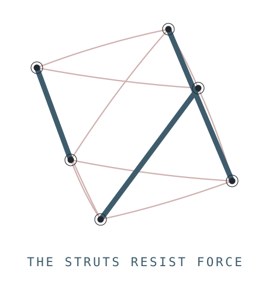

# Tensegrity Compressive Standards

<picture>
  <source media="(prefers-color-scheme: dark)" srcset="../../images/compressive-struts-0_1_0-dark.svg">
  
</picture>

Seven standards that specify structural floors: the minimum conditions a coordination system must hold to prevent predictable failure modes. Each standard is an instrument with verifiable conditions. They specify what must not be violated; they do not specify how to organize.

In the suite's tensegrity architecture these are the struts: the members that hold their form under adversarial pressure. They are discontinuous by design, each standalone and independently adoptable, and they stay in position only because the [three generative standards](../generative/) carry tension around them. A compressive floor whose generative conditions are absent still holds, but its detection results degrade: the [detection reliability dependencies](../../README.md#how-the-standards-work-together) name exactly which audits become untrustworthy when which generative conditions are missing.

## The seven standards

| Standard | Version | Requires | Text |
| --- | --- | --- | --- |
| **Precision-First Design** | 2.4.3 | Every element of a coordination system increases the precision with which the system's dynamics can be observed, classified, and acted upon. The suite's meta-standard: all nine other standards' conformance language is held to it. | [Read](standards/standards-3_0-precision-first-2_4_3.md) |
| **Adverse-Signal Engagement Principle** | 0.7.13 | Engagement with signals that contradict current models, rather than suppression or reframing. | [Read](standards/standards-3_0-adverse-signal-engagement-0_7_13.md) |
| **Structural Consent Legibility** | 0.3.25 | Consent to participation is structurally distinguishable from consent to specific terms, outcomes, and power arrangements. | [Read](standards/standards-3_0-structural-consent-0_3_25.md) |
| **Information Asymmetry Classification** | 0.1.26 | Classification and disclosure of the structural types of information asymmetry present in a coordination system. Six primary classes. | [Read](standards/standards-3_0-information-asymmetry-0_1_26.md) |
| **Structural Power Obligation** | 0.1.26 | Structural power arrangements across three independent dimensions (authority, coordination, specialization) are legible and contestable by participants who hold less of them. | [Read](standards/standards-3_0-structural-power-obligation-0_1_26.md) |
| **Regenerative Obligation** | 0.1.8 | Extraction of contributor capacity is matched by regenerative return satisfying three conditions simultaneously: non-fungibility, proximity, and embeddedness. | [Read](standards/standards-3_0-regenerative-obligation-0_1_8.md) |
| **Coordination Scaling** | 0.1.5 | Coordination systems install the structural conditions each Dunbar-scale threshold requires before crossing it. | [Read](standards/standards-3_0-coordination-scaling-0_1_5.md) |

Full architectural summaries for every standard are in the [suite README](../../README.md#the-seven-tensegrity-compressive-standards).

## Working with these standards

Each standard has an AI audit prompt in [`prompts/`](prompts/) (one subfolder per standard) and a Claude skill in [`skills/`](skills/). The prompts are the designed entry point: copy one into any AI assistant, then supply the document or system description to audit. The [prompt launcher site](https://coordination-structural-integrity-suite.github.io/ai/) serves all of them without navigating this repository.

Companion specifications live in [`specifications/`](specifications/). Adoption is tiered (Assessed, Operational, Instrumented, Loop-Closed, Auditable) and each standard can be adopted independently; the [adoption architecture](../../README.md#adoption-architecture) defines the tiers and the claims they do and do not license.
